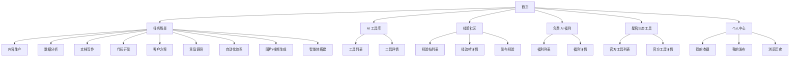
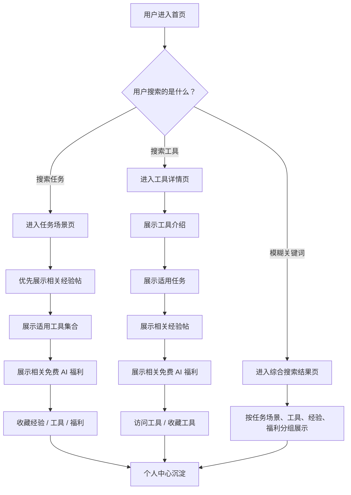

# AI 工具经验社区 PRD

## 1. 文档信息

| 项目   | 内容                                      |
| ---- | --------------------------------------- |
| 产品名称 | AI 工具经验社区                               |
| 产品类型 | 面向互联网公司工作场景的 AI 工具使用经验社区                |
| 目标平台 | Web                                     |
| 文档版本 | V1.1                                    |
| 核心模块 | 任务场景、AI 工具库、经验社区、免费 AI 福利、个人中心、星启生态工具入口 |

---

## 2. 产品背景

AI 工具已经进入互联网公司日常工作场景。用户会尝试用 AI 工具完成内容生产、竞品分析、文档写作、代码辅助、客户方案、数据分析、素材生成等任务。

但在真实使用中，用户仍然面临明显问题：

- 不知道某个任务适合用哪些 AI 工具；
- 知道工具，但不知道如何用出稳定、可交付的效果；
- AI 工具使用方法分散在公众号、短视频、社群、官方文档和个人经验中，缺少统一沉淀；
- 工具介绍和真实工作任务之间存在距离；
- 用户缺少同任务、同工具下的真实案例参考；
- 用户希望低成本尝试 AI 工具，但不知道有哪些免费额度、试用权益和活动福利。

因此，本产品希望通过“任务场景 + 工具库 + 经验社区 + 免费 AI 福利”的方式，把分散的 AI 工具使用方法集中沉淀起来，帮助用户发现工具、学习用法、低成本尝试并形成个人收藏资产。

---

## 3. 产品定位

本产品定位为：

> 面向互联网公司工作场景的 AI 工具使用经验社区，帮助用户围绕具体任务发现合适的 AI 工具，并通过真实经验学习如何用出更好的效率和效果。

产品不是单纯的 AI 工具导航，而是围绕具体任务场景，把工具介绍、使用经验、业务方法、免费福利和官方产品入口组织在一起。

一句话定位：

> 帮助用户找到适合当前任务的 AI 工具，并通过真实经验学会怎么用好。

---

## 4. 目标用户

本产品面向互联网公司中需要使用 AI 工具提升工作效率的人群，主要覆盖运营、产品、全栈研发、售前/销售等岗位。

需要注意的是：**岗位不作为产品的核心筛选入口，只作为内容标签和适用范围展示。**

用户进入产品时更常见的真实需求是：

> 我现在要完成一个任务，应该用什么 AI 工具？别人是怎么用的？有没有可以免费试用的权益？

典型用户与任务包括：

| 用户类型  | 典型任务                          | 用户需求                               |
| ----- | ----------------------------- | ---------------------------------- |
| 运营    | 内容选题、活动策划、用户增长、数据分析、社群运营、投放素材 | 快速产出内容、方案和分析结论，学习别人如何用 AI 工具提升业务效果 |
| 产品    | 竞品分析、需求整理、PRD 初稿、用户反馈归类、原型说明  | 快速整理信息、形成结构化方案，并参考真实工具使用经验         |
| 全栈研发  | 代码生成、Bug 定位、接口文档、技术方案、脚手架搭建   | 借助 AI 工具提升开发效率、定位问题和生成技术文档         |
| 售前/销售 | 客户方案、行业资料整理、销售话术、标书材料、CRM 跟进  | 快速理解客户、生成方案和话术，提升客户沟通效率            |

---

## 5. 核心问题

### 5.1 不知道具体任务适合用哪些 AI 工具

用户通常不是先想“我是哪个岗位”，而是先想“我要完成什么任务”。

例如：

- 做竞品分析应该用什么工具；
- 写活动策划应该用什么工具；
- 定位接口 Bug 应该用什么工具；
- 做客户方案应该用什么工具；
- 整理用户访谈应该用什么工具。

### 5.2 知道工具，但用出来的效果不好

用户已经尝试过 AI 工具，但由于任务描述不清、资料准备不足、操作方法不稳定，导致输出结果泛泛而谈，难以直接用于工作。

### 5.3 AI 工具使用方法太分散

用户学习 AI 工具的方法分散在多个渠道，包括公众号、短视频、社群、个人笔记、工具官方文档等。内容分散且质量不稳定，用户难以持续查找、收藏和复用。

### 5.4 缺少同任务、同工具的真实经验

用户更希望看到“别人如何用这个工具完成同类任务”，而不是只看工具功能介绍。

### 5.5 低成本尝试工具的信息不足

很多 AI 工具有免费额度、限时试用、新用户权益、开发者额度或官方体验入口，但用户不知道哪里能集中查看这些信息。

---

## 6. 产品目标

### 6.1 用户目标

- 快速找到适合当前任务的 AI 工具；
- 通过经验帖学习工具在真实任务中的使用方法；
- 发现并领取可用的免费 AI 福利；
- 收藏有价值的工具、经验和福利；
- 在个人中心沉淀自己的 AI 工具使用资产。

### 6.2 业务目标

- 建立围绕任务场景的 AI 工具经验内容库；
- 提升用户对平台的访问频率和内容停留；
- 通过免费 AI 福利增强用户回访；
- 将星启生态产品自然接入工具库和经验内容体系；
- 为后续用户发布、内容推荐和社区增长打基础。

---

## 7. 产品信息架构

### 7.1 页面清单

| 页面        | 页面类型 | 主要使用者  | 页面目标                      |
| --------- | ---- | ------ | ------------------------- |
| 首页        | 前台页面 | 全部用户   | 承接搜索、任务场景、工具、经验、福利和星启生态入口 |
| 任务场景页     | 前台页面 | 全部用户   | 按任务聚合工具、经验和福利             |
| AI 工具库页   | 前台页面 | 全部用户   | 展示和筛选 AI 工具               |
| 工具详情页     | 前台页面 | 全部用户   | 展示工具介绍、适用任务、相关经验和福利       |
| 经验社区页     | 前台页面 | 全部用户   | 展示、筛选和搜索经验帖               |
| 经验帖详情页    | 前台页面 | 全部用户   | 阅读完整经验内容并进行互动             |
| 发布经验页     | 前台页面 | 登录用户   | 发布 AI 工具使用经验              |
| 免费 AI 福利页 | 前台页面 | 全部用户   | 展示可领取、试用或低成本使用的 AI 福利     |
| 福利详情页     | 前台页面 | 全部用户   | 展示福利内容、领取方式、限制和相关内容       |
| 个人中心页     | 前台页面 | 登录用户   | 查看收藏、发布、浏览历史和账号入口         |
| 搜索结果页     | 前台页面 | 全部用户   | 承接无法明确识别为任务或工具的模糊搜索，聚合展示工具、经验、福利和任务场景结果 |
| 工具管理页     | 后台页面 | 官方运营账号 | 新增、编辑、下架工具                |
| 经验内容管理页   | 后台页面 | 官方运营账号 | 审核、精选、编辑、下架经验帖            |
| 福利管理页     | 后台页面 | 官方运营账号 | 维护免费 AI 福利信息              |

### 7.2 前台导航建议

第一版前台主导航建议包含：

- 首页
- 任务场景
- AI 工具库
- 经验社区
- 免费 AI 福利
- 星启生态工具
- 发布经验
- 登录/个人中心

导航层级不宜过深，优先保证用户能快速进入工具、经验和福利三类核心内容。

---

## 8. 用户主流程

### 8.1 两条主路径

### 8.2 任务搜索路径

用户搜索的是“我要完成什么任务”，例如竞品分析、活动策划、客户方案、用户访谈整理、Bug 定位。

此时系统应进入任务场景页，页面重点顺序为：

1. 任务说明；
2. 相关经验帖；
3. 适用工具集合；
4. 相关免费 AI 福利；
5. 相似任务。

该路径里，经验帖是核心内容，工具是完成任务的辅助方案。

### 8.3 工具搜索路径

用户搜索的是明确工具名称，例如 Kimi、Cursor、ChatGPT、星启·文枢、星启·数璇。

此时系统应进入工具详情页，页面重点顺序为：

1. 工具基础介绍；
2. 适用任务；
3. 相关经验帖；
4. 相关免费 AI 福利；
5. 访问工具和收藏入口。

该路径里，工具详情页承载“这个工具能做什么、别人怎么用、有什么福利”的完整信息。

### 8.4 综合搜索路径

当用户输入的关键词无法明确判断为任务或工具时，进入综合搜索结果页，按内容类型分组展示：

- 任务场景；
- 工具；
- 经验帖；
- 免费 AI 福利。

用户点击不同结果后，再进入对应任务场景页、工具详情页、经验帖详情页或福利详情页。

### 8.5 领取免费 AI 福利

用户进入免费 AI 福利列表，通过工具、福利类型、有效期筛选福利，进入福利详情页查看领取方式，并跳转领取。

### 8.6 发布经验

登录用户可以发布经验帖，填写适用任务、使用工具、适用岗位标签、操作过程、输出效果和使用心得。

---

## 9. 功能需求

## 9.1 首页

### 9.1.1 页面目标

首页作为产品统一入口，帮助用户快速进入任务场景、工具库、经验社区、免费 AI 福利和星启生态工具。

### 9.1.2 页面模块

| 模块       | 说明                            |
| -------- | ----------------------------- |
| 顶部导航     | 展示产品名称、搜索入口、发布经验、登录/个人中心      |
| 搜索框      | 支持搜索工具、经验、福利、任务               |
| 热门任务场景   | 展示内容生产、数据分析、文档写作、代码开发、客户方案等任务 |
| 热门经验     | 展示热门或官方精选经验帖                  |
| 热门工具     | 展示近期关注度较高的 AI 工具              |
| 免费 AI 福利 | 展示今日可领取、试用或低成本使用的福利           |
| 星启生态工具   | 展示公司官方工具入口                    |

### 9.1.3 交互规则

- 点击任务场景入口进入任务场景页；
- 点击经验帖卡片进入经验帖详情页；
- 点击工具卡片进入工具详情页；
- 点击福利卡片进入福利详情页；
- 点击发布经验时，未登录用户引导登录；
- 点击登录/个人中心时，根据登录状态进入对应页面。

### 9.1.4 页面字段

| 内容类型   | 字段                            |
| ------ | ----------------------------- |
| 任务场景卡片 | 任务名称、任务说明、关联工具数、关联经验数         |
| 经验卡片   | 标题、任务、工具、适用岗位标签、作者、热度、官方标识    |
| 工具卡片   | 工具名称、工具类型、适用任务、适用岗位标签、简介、官方标识 |
| 福利卡片   | 福利名称、对应工具、福利类型、有效期、领取状态       |

---

## 9.2 任务场景页

### 9.2.1 页面目标

按任务聚合工具、经验和福利，让用户从“我要完成什么”出发查找内容。

### 9.2.2 任务场景分类

第一版建议先覆盖以下任务场景：

| 任务场景    | 典型任务                    |
| ------- | ----------------------- |
| 内容生产    | 选题、文案、脚本、标题、社群话术        |
| 数据分析    | 数据解读、指标归因、用户反馈分析、运营分析   |
| 文档写作    | PRD、方案、报告、合同、标书、会议纪要    |
| 代码开发    | 代码生成、Bug 定位、接口文档、技术方案   |
| 客户方案    | 客户背景整理、销售话术、售前方案、CRM 跟进 |
| 竞品调研    | 竞品信息整理、功能对比、市场分析、用户评价分析 |
| 自动化效率   | 表格处理、流程自动化、信息整理、批量处理    |
| 图片/视频生成 | 海报、配图、短视频脚本、素材方向        |
| 智能体搭建   | 业务智能体、知识库助手、客服助手、流程编排   |

### 9.2.3 功能需求

| 功能     | 说明                  |
| ------ | ------------------- |
| 任务场景切换 | 支持在不同任务场景之间切换       |
| 子任务分类  | 展示当前任务场景下的具体任务      |
| 推荐工具   | 展示适合当前任务的工具         |
| 推荐经验   | 展示当前任务相关经验帖         |
| 相关福利   | 展示当前任务可用的免费 AI 福利   |
| 辅助岗位标签 | 展示内容适合哪些岗位，但不作为核心筛选 |
| 筛选排序   | 支持按工具、热度、最新、官方精选筛选  |

### 9.2.4 交互规则

- 点击任务场景后，页面内容整体刷新；
- 点击子任务标签后，筛选对应工具、经验和福利；
- 点击工具进入工具详情页；
- 点击经验进入经验帖详情页；
- 点击福利进入福利详情页；
- 适用岗位标签只用于辅助识别，不作为主路径。

---

## 9.3 AI 工具库

### 9.3.1 页面目标

帮助用户发现适合当前任务的 AI 工具，并通过工具连接相关经验和福利。

### 9.3.2 功能需求

| 功能     | 说明                      |
| ------ | ----------------------- |
| 工具列表   | 展示平台收录的 AI 工具           |
| 工具搜索   | 支持按工具名称、简介搜索            |
| 任务场景筛选 | 按内容生产、数据分析、文档写作、代码开发等筛选 |
| 工具类型筛选 | 按写作、数据、设计、开发、自动化等分类筛选   |
| 适用岗位标签 | 展示工具适合哪些岗位              |
| 官方工具筛选 | 筛选星启生态工具                |
| 工具收藏   | 登录用户可收藏工具               |

### 9.3.3 工具列表字段

| 字段      | 说明                    |
| ------- | --------------------- |
| 工具名称    | AI 工具名称               |
| 工具 Logo | 工具图标                  |
| 工具简介    | 一句话说明                 |
| 工具类型    | 写作、数据、设计、开发、自动化等      |
| 适用任务    | 可解决的具体任务              |
| 适用岗位标签  | 运营、产品、全栈研发、售前/销售等辅助标签 |
| 是否官方工具  | 是否为星启生态工具             |
| 热度      | 浏览、收藏或运营配置            |

---

## 9.4 工具详情页

### 9.4.1 页面目标

让用户理解一个工具适合完成哪些任务，以及有哪些经验和福利可以继续查看。

### 9.4.2 页面模块

| 模块     | 说明                |
| ------ | ----------------- |
| 工具基础信息 | 工具名称、简介、类型、Logo   |
| 适用任务   | 展示可完成任务           |
| 适用岗位标签 | 展示适合哪些岗位，但仅作为辅助信息 |
| 使用门槛   | 标注新手友好、进阶、专业等     |
| 相关经验   | 展示该工具相关经验帖        |
| 相关福利   | 展示该工具当前福利         |
| 操作按钮   | 访问工具、收藏工具         |

### 9.4.3 交互规则

- 点击访问工具，跳转外部工具或内部官方产品；
- 点击收藏，未登录时引导登录；
- 点击相关经验进入经验帖详情；
- 点击相关福利进入福利详情。

---

## 9.5 经验社区

### 9.5.1 页面目标

经验社区是核心内容模块，用于沉淀 AI 工具在真实任务中的使用方法。

### 9.5.2 功能需求

| 功能     | 说明          |
| ------ | ----------- |
| 经验帖列表  | 展示全部经验内容    |
| 任务场景筛选 | 按任务场景筛选经验   |
| 工具筛选   | 按使用工具筛选     |
| 适用岗位标签 | 展示内容适合哪些岗位  |
| 官方精选   | 筛选官方精选经验    |
| 最新排序   | 按发布时间排序     |
| 热门排序   | 按浏览、点赞、收藏排序 |
| 发布经验   | 登录用户可发布经验帖  |

### 9.5.3 经验帖列表字段

| 字段     | 说明       |
| ------ | -------- |
| 标题     | 经验帖标题    |
| 摘要     | 内容摘要     |
| 作者     | 发布者信息    |
| 适用任务   | 对应任务     |
| 使用工具   | 关联 AI 工具 |
| 适用岗位标签 | 辅助说明适合人群 |
| 发布时间   | 发布时间     |
| 浏览量    | 阅读数据     |
| 点赞数    | 点赞数据     |
| 收藏数    | 收藏数据     |
| 官方精选   | 是否官方精选   |

---

## 9.6 经验帖详情页

### 9.6.1 页面目标

让用户完整理解一篇经验，并能继续跳转到相关工具、福利或其他经验。

### 9.6.2 内容结构

| 模块     | 说明              |
| ------ | --------------- |
| 任务背景   | 这篇经验解决什么问题      |
| 使用工具   | 使用了哪些 AI 工具     |
| 适用任务   | 对应的任务场景         |
| 适用岗位标签 | 适合哪些岗位参考        |
| 使用前准备  | 需要准备哪些材料        |
| 操作过程   | 具体怎么做           |
| 输出效果   | 最终产出什么          |
| 使用心得   | 哪些地方有效，哪些地方需要注意 |
| 可复用要点  | 用户可以直接借鉴的部分     |
| 相关推荐   | 相关工具、经验和福利      |

### 9.6.3 交互规则

- 未登录用户可浏览正文；
- 登录用户可点赞、收藏、评论、分享；
- 点击相关工具进入工具详情；
- 点击相关福利进入福利详情；
- 点击相关推荐进入对应详情页。

---

## 9.7 发布经验页

### 9.7.1 页面目标

让用户按统一结构发布 AI 工具使用经验，降低内容生产门槛，并保证社区内容质量。

### 9.7.2 表单字段

| 字段     | 是否必填 | 说明                   |
| ------ | ---- | -------------------- |
| 标题     | 是    | 经验帖标题                |
| 适用任务   | 是    | 该经验对应的任务场景           |
| 使用工具   | 是    | 关联 AI 工具             |
| 适用岗位标签 | 否    | 运营、产品、全栈研发、售前/销售，可多选 |
| 使用前准备  | 否    | 需要准备的材料              |
| 操作过程   | 是    | 具体使用方法               |
| 输出效果   | 否    | 最终产出示例               |
| 使用心得   | 否    | 经验总结                 |
| 图片/附件  | 否    | 辅助说明材料               |
| 是否公开   | 是    | 公开或仅自己可见             |

### 9.7.3 交互规则

- 未登录用户点击发布时引导登录；
- 必填项未填写时提示补充；
- 支持保存草稿；
- 支持预览；
- 提交后进入发布成功或审核状态。

---

## 9.8 免费 AI 福利模块

### 9.8.1 页面目标

集中展示用户每天可以领取、试用或低成本使用的 AI 工具权益，增强用户回访。

### 9.8.2 功能需求

| 功能     | 说明               |
| ------ | ---------------- |
| 福利列表   | 展示当前可领取福利        |
| 福利搜索   | 按工具名或福利名搜索       |
| 工具筛选   | 按对应工具筛选          |
| 任务场景筛选 | 按可服务的任务场景筛选      |
| 有效期筛选  | 查看今日可领、即将过期、长期有效 |
| 福利详情   | 查看领取方式和使用限制      |
| 收藏福利   | 登录用户可收藏福利        |
| 领取跳转   | 跳转到福利领取页面        |

### 9.8.3 福利字段

| 字段     | 说明                   |
| ------ | -------------------- |
| 福利名称   | 如“新用户注册送 100 次调用额度”  |
| 对应工具   | 福利所属 AI 工具           |
| 适用任务   | 可用于哪些任务场景            |
| 适用岗位标签 | 辅助说明适合人群             |
| 福利类型   | 免费额度、会员试用、活动券、开发者额度等 |
| 有效期    | 截止时间或长期有效            |
| 领取状态   | 可领取、即将过期、已结束         |
| 是否验证   | 是否由官方或运营验证           |
| 领取方式   | 领取步骤或跳转链接            |
| 使用限制   | 地区、账号、次数、时间等限制       |

### 9.8.4 交互规则

- 点击福利卡片进入福利详情；
- 点击领取跳转到外部链接或星启生态产品；
- 福利过期后展示已结束状态；
- 未登录用户点击收藏时引导登录；
- 福利详情页推荐相关工具和经验帖。

---

## 9.9 个人中心

### 9.9.1 页面目标

与现有用户中心打通，沉淀用户收藏、发布和浏览历史。

### 9.9.2 功能需求

| 功能    | 说明             |
| ----- | -------------- |
| 登录/注册 | 接入统一用户中心       |
| 个人资料  | 展示基础用户信息       |
| 我的收藏  | 查看收藏的工具、经验帖、福利 |
| 我的发布  | 查看自己发布的经验帖     |
| 浏览历史  | 查看最近浏览内容       |
| 账号入口  | 跳转统一用户中心       |

### 9.9.3 收藏类型

| 类型    | 说明              |
| ----- | --------------- |
| 收藏工具  | 用户感兴趣的 AI 工具    |
| 收藏经验帖 | 可复用的经验内容        |
| 收藏福利  | 想领取或后续查看的 AI 福利 |

---

## 9.10 星启生态工具入口

### 9.10.1 页面目标

将公司现有产品作为官方 AI 工具接入平台，使其自然出现在工具库、经验帖和福利模块中。

### 9.10.2 接入产品

| 产品    | 定位              |
| ----- | --------------- |
| 星启·数璇 | 拟人化数据智能体        |
| 小狸报告  | 访谈中心 App        |
| 星启脉擎  | 智能体开发平台         |
| 星启·文枢 | 文档、合同写作智能体      |
| 星启·元界 | 企业数字化建设生产应用搭建平台 |
| 星启·轻翼 | CRM APP 创建平台    |

### 9.10.3 功能需求

| 功能     | 说明               |
| ------ | ---------------- |
| 官方工具展示 | 在工具库中标记官方工具      |
| 产品入口跳转 | 跳转到对应产品          |
| 关联经验帖  | 展示该产品相关使用经验      |
| 关联任务场景 | 展示该产品适合哪些任务      |
| 关联福利   | 展示该产品是否有试用、活动或权益 |

---

## 9.11 运营管理后台

### 9.11.1 页面目标

后台用于支撑工具库、经验社区、免费 AI 福利和星启生态工具的内容维护。第一版可以先做轻量管理能力，重点保证内容可新增、可编辑、可下架、可标记精选。

### 9.11.2 工具管理

| 功能     | 说明                        |
| ------ | ------------------------- |
| 新增工具   | 录入工具基础信息                  |
| 编辑工具   | 修改工具名称、简介、分类、适用任务、适用岗位标签等 |
| 上下架工具  | 控制工具是否在前台展示               |
| 标记官方工具 | 将星启生态产品标记为官方工具            |
| 关联经验帖  | 为工具绑定相关经验内容               |
| 关联福利   | 为工具绑定相关免费福利               |

工具管理字段包括：

| 字段      | 是否必填 | 说明               |
| ------- | ---- | ---------------- |
| 工具名称    | 是    | AI 工具名称          |
| 工具 Logo | 否    | 工具图标             |
| 工具简介    | 是    | 一句话介绍            |
| 工具类型    | 是    | 写作、数据、设计、开发、自动化等 |
| 适用任务    | 是    | 可多选或手动录入         |
| 适用岗位标签  | 否    | 可多选，用于辅助展示       |
| 访问链接    | 否    | 工具官网或内部产品链接      |
| 是否官方工具  | 是    | 是/否              |
| 展示状态    | 是    | 上架/下架            |

### 9.11.3 经验内容管理

| 功能     | 说明               |
| ------ | ---------------- |
| 查看经验列表 | 查看全部用户和官方发布的经验帖  |
| 审核经验帖  | 对用户投稿内容进行审核      |
| 编辑经验帖  | 修正标题、标签、任务、工具等信息 |
| 设置官方精选 | 将高质量内容标记为官方精选    |
| 下架经验帖  | 对违规或过期内容进行下架     |
| 管理评论   | 删除违规评论           |

经验内容管理字段包括：

| 字段     | 说明          |
| ------ | ----------- |
| 标题     | 经验帖标题       |
| 作者     | 发布用户        |
| 适用任务   | 内容对应任务      |
| 使用工具   | 内容关联工具      |
| 适用岗位标签 | 辅助标签        |
| 审核状态   | 待审核、已通过、已拒绝 |
| 是否官方精选 | 是/否         |
| 发布时间   | 内容发布时间      |

### 9.11.4 免费 AI 福利管理

| 功能     | 说明               |
| ------ | ---------------- |
| 新增福利   | 录入新的 AI 福利信息     |
| 编辑福利   | 修改福利内容、有效期、领取方式等 |
| 下架福利   | 福利过期或失效后下架       |
| 标记验证状态 | 标记福利是否已由运营验证     |
| 关联工具   | 将福利绑定到对应 AI 工具   |
| 关联经验帖  | 为福利绑定相关使用经验      |

福利管理字段包括：

| 字段     | 是否必填 | 说明                   |
| ------ | ---- | -------------------- |
| 福利名称   | 是    | 福利标题                 |
| 对应工具   | 是    | 关联 AI 工具             |
| 福利类型   | 是    | 免费额度、限时试用、活动券、开发者额度等 |
| 适用任务   | 是    | 可多选                  |
| 适用岗位标签 | 否    | 辅助展示                 |
| 有效期    | 是    | 截止时间或长期有效            |
| 领取方式   | 是    | 领取说明或链接              |
| 使用限制   | 否    | 账号、地区、次数、时间等限制       |
| 是否验证   | 是    | 运营是否验证有效             |
| 展示状态   | 是    | 上架/下架                |

### 9.11.5 后台权限

| 角色   | 权限                |
| ---- | ----------------- |
| 普通运营 | 新增和编辑工具、经验、福利内容   |
| 审核运营 | 审核用户发布经验，设置官方精选   |
| 管理员  | 管理全部内容、账号权限和上下架状态 |

第一版后台不需要复杂权限体系，可以先区分普通用户、官方运营账号和管理员三类角色。

---

## 10. 搜索功能

### 10.1 搜索范围

| 搜索对象 | 搜索字段                   |
| ---- | ---------------------- |
| 工具   | 工具名称、简介、类型、适用任务、适用岗位标签 |
| 经验帖  | 标题、摘要、正文、任务、工具、适用岗位标签  |
| 福利   | 福利名称、工具、福利类型、领取方式、适用任务 |
| 任务场景 | 任务场景名称、子任务名称           |

### 10.2 搜索结果分类

搜索结果页按以下类型展示：

- 全部；
- 工具；
- 经验；
- 福利；
- 任务场景。

### 10.3 交互规则

- 输入关键词后点击搜索进入搜索结果页；
- 搜索结果支持按类型切换；
- 无结果时展示空状态，并推荐热门工具、热门经验和免费福利。

---

## 11. 权限规则

### 11.1 未登录用户

| 可操作          | 不可操作   |
| ------------ | ------ |
| 浏览首页         | 收藏     |
| 浏览任务场景       | 点赞     |
| 浏览工具库和工具详情   | 评论     |
| 浏览经验社区和经验帖详情 | 发布经验   |
| 浏览免费福利和福利详情  | 查看个人中心 |

### 11.2 登录用户

| 功能   | 说明          |
| ---- | ----------- |
| 收藏   | 收藏工具、经验帖、福利 |
| 点赞   | 点赞经验帖       |
| 评论   | 评论经验帖       |
| 发布   | 发布经验帖       |
| 个人中心 | 查看个人资产      |

### 11.3 官方运营账号

| 功能     | 说明          |
| ------ | ----------- |
| 发布官方经验 | 发布带官方标识的经验帖 |
| 维护工具库  | 新增或编辑工具     |
| 维护福利   | 新增、编辑、下架福利  |
| 设置精选   | 标记官方精选内容    |

---

## 12. 状态设计

### 12.1 通用状态

| 状态    | 说明                   |
| ----- | -------------------- |
| 加载中   | 列表、详情、搜索结果请求时展示      |
| 空状态   | 无工具、无经验、无福利、无搜索结果时展示 |
| 错误状态  | 网络错误或数据加载失败时展示       |
| 未登录状态 | 触发收藏、点赞、评论、发布时引导登录   |
| 已收藏状态 | 收藏按钮变为已收藏            |
| 已结束状态 | 福利过期后显示已结束           |

### 12.2 空状态文案示例

| 场景    | 文案                   |
| ----- | -------------------- |
| 无搜索结果 | 暂时没有找到相关内容，可以换个关键词试试 |
| 无经验帖  | 当前任务下还没有相关经验，先看看其他任务 |
| 无福利   | 当前暂无可领取福利，稍后再来看看     |
| 未登录收藏 | 登录后可以收藏工具、经验和福利      |

---

## 13. MVP 范围

### 13.1 P0 功能

| 功能         | 说明               |
| ---------- | ---------------- |
| 首页         | 完成核心入口和内容分发      |
| 任务场景页      | 支持任务分类展示         |
| AI 工具库     | 支持工具列表、搜索、筛选     |
| 工具详情页      | 展示工具信息、相关经验和福利   |
| 经验社区列表     | 支持经验内容展示和筛选      |
| 经验帖详情      | 展示经验正文和互动入口      |
| 免费 AI 福利列表 | 展示福利列表和筛选        |
| 福利详情页      | 展示福利内容、领取方式和相关内容 |
| 登录/个人中心    | 接入统一用户中心         |
| 收藏功能       | 收藏工具、经验帖、福利      |

### 13.2 P1 功能

| 功能       | 说明           |
| -------- | ------------ |
| 发布经验帖    | 用户发布经验内容     |
| 评论       | 经验帖评论        |
| 点赞       | 经验帖点赞        |
| 官方精选     | 运营标记高质量内容    |
| 星启生态工具入口 | 官方工具展示和跳转    |
| 搜索结果页    | 聚合工具、经验、福利结果 |

### 13.3 P2 功能

| 功能     | 说明               |
| ------ | ---------------- |
| 浏览历史   | 记录用户浏览内容         |
| 福利订阅提醒 | 订阅工具或福利更新        |
| 工具热度榜  | 展示热门工具排行         |
| 经验内容推荐 | 根据任务、工具和浏览行为推荐内容 |

---

## 14. 内容冷启动

### 14.1 首批工具内容

首批工具建议覆盖主要任务场景，每个任务场景至少准备 5-10 个工具。

工具内容需要包含：

- 工具名称；
- 工具简介；
- 工具类型；
- 适用任务；
- 适用岗位标签；
- 访问入口；
- 是否官方工具；
- 相关经验帖；
- 相关福利。

### 14.2 首批经验内容

首批经验帖建议由官方运营账号发布，保证内容质量和结构统一。

建议覆盖：

- 内容生产：选题、文案、脚本、标题；
- 数据分析：用户反馈分析、运营数据分析、指标归因；
- 文档写作：PRD、方案、报告、标书；
- 代码开发：代码生成、Bug 定位、接口文档；
- 客户方案：客户背景整理、销售话术、售前方案；
- 竞品调研：竞品信息整理、功能对比、市场分析。

### 14.3 首批福利内容

首批福利由运营人工维护，保证准确性。

福利类型包括：

- 免费额度；
- 新用户试用；
- 限时会员；
- 开发者额度；
- 官方工具体验；
- 学生或企业权益。

---

## 15. 数据指标

### 15.1 内容指标

| 指标      | 说明              |
| ------- | --------------- |
| 工具收录数   | 平台已收录工具数量       |
| 经验帖数量   | 平台经验内容数量        |
| 官方精选数量  | 官方精选经验帖数量       |
| 福利数量    | 可查看福利数量         |
| 福利有效率   | 未过期福利占比         |
| 任务场景覆盖率 | 已覆盖任务场景数量和内容充足度 |

### 15.2 用户行为指标

| 指标       | 说明             |
| -------- | -------------- |
| 首页点击率    | 首页各模块点击情况      |
| 任务场景点击率  | 用户点击任务场景的比例    |
| 工具详情页访问量 | 用户查看工具详情次数     |
| 经验帖阅读量   | 经验内容阅读情况       |
| 收藏率      | 工具、经验、福利收藏比例   |
| 福利领取点击率  | 福利详情页到领取按钮点击比例 |
| 发布经验数    | 用户发布经验数量       |

### 15.3 留存指标

| 指标      | 说明            |
| ------- | ------------- |
| 次日回访率   | 用户第二天是否回来     |
| 7 日回访率  | 用户 7 天内是否回来   |
| 收藏后回访率  | 收藏用户是否回来查看    |
| 福利模块回访率 | 用户是否因福利模块持续访问 |

---

## 16. 验收标准

### 16.1 页面验收

- 首页能进入任务场景、工具库、经验社区、免费福利、个人中心；
- 任务场景页能切换不同任务分类；
- 工具库能搜索和筛选工具；
- 工具详情能展示相关经验和福利；
- 经验社区能按任务和工具筛选经验帖；
- 经验帖详情能展示完整内容结构；
- 免费福利页能筛选福利；
- 福利详情能展示领取方式；
- 个人中心能展示收藏和发布入口。

### 16.2 交互验收

- 未登录用户触发收藏、点赞、评论、发布时需要引导登录；
- 登录用户可以收藏工具、经验帖和福利；
- 列表筛选后内容正确刷新；
- 详情页跳转路径清晰；
- 外部工具和星启生态工具入口可以正常跳转；
- 空状态、加载状态、错误状态有明确提示。

### 16.3 内容验收

- 工具内容必须关联任务场景；
- 经验帖必须关联任务和工具；
- 福利必须关联工具、任务和有效期；
- 适用岗位只作为辅助标签展示；
- 官方工具需要有明确标识；
- 官方精选经验需要有明确标识。

---

## 17. 风险与注意事项

| 风险        | 说明             | 应对方式                    |
| --------- | -------------- | ----------------------- |
| 任务分类过多    | 任务过多会造成分类复杂    | 第一版先控制在 8-10 个一级任务场景    |
| 任务边界重叠    | 同一内容可能适用于多个任务  | 支持多任务标签，不强行单一归类         |
| 福利信息过期    | 免费 AI 福利时效性强   | 由运营维护有效期和状态             |
| 经验内容质量不稳定 | 用户投稿质量可能参差不齐   | 初期以官方内容建立标准             |
| 工具库变成普通导航 | 如果只展示工具列表，价值不足 | 每个工具必须关联任务、经验和福利        |
| 官方产品入口过重  | 过度展示公司产品会影响社区感 | 官方工具以“工具库 + 经验内容”方式自然接入 |
| 用户发布门槛高   | 表单过长会降低发布率     | 发布结构保持清晰，支持草稿和预览        |

---

## 18. 下一步工作

PRD 确认后，下一步进入更规范的页面原型设计。

建议先完成以下页面：

1. 首页
2. 任务场景页
3. AI 工具库页
4. 工具详情页
5. 经验社区页
6. 经验帖详情页
7. 免费 AI 福利页
8. 福利详情页
9. 发布经验页
10. 个人中心页

原型设计重点是验证：

- 页面信息是否完整；
- 用户路径是否顺畅；
- 模块之间是否能互相连接；
- 任务场景是否作为主入口呈现；
- 岗位是否只作为辅助标签出现；
- 经验社区、工具库、免费福利是否形成闭环。
